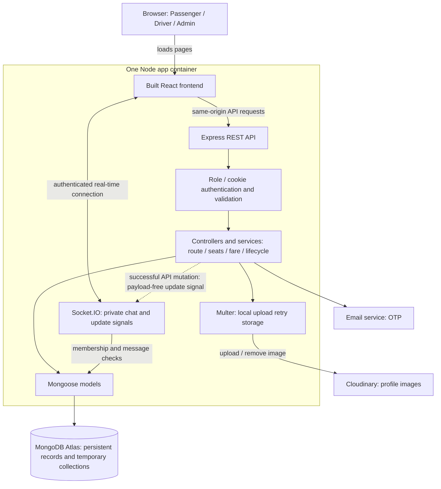
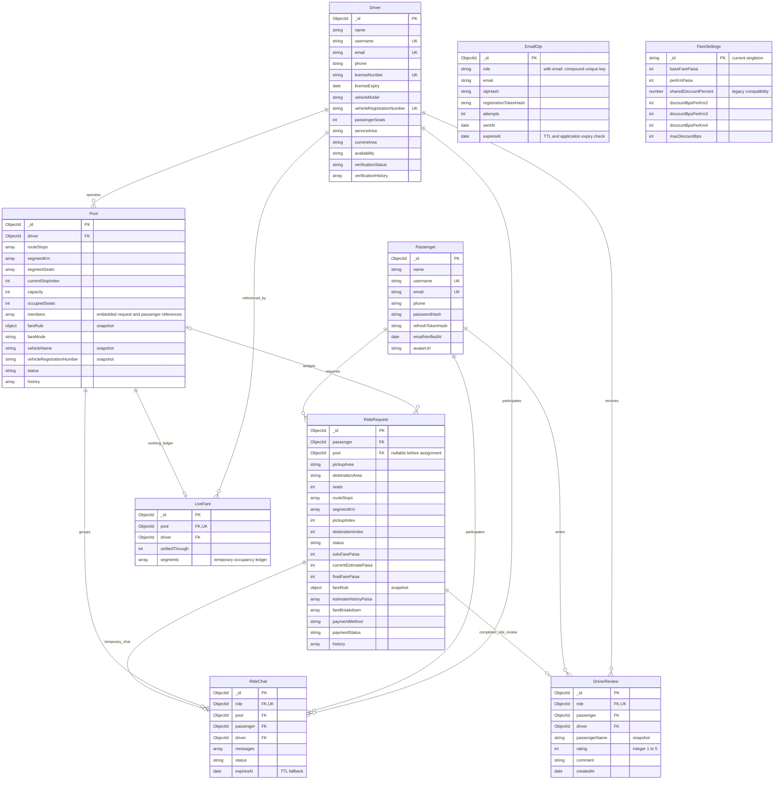

# Dhaka Tesla Pool — six-minute demo guide

এই guide বর্তমান code ও README অনুযায়ী। শুধু presentation/documentation; নতুন feature নয়। লক্ষ্য: ৫:৪৫ মিনিট, সর্বোচ্চ ৬ মিনিট। নিচের বক্তব্য নিজের ভাষায় বলবে—হুবহু মুখস্থ করার প্রয়োজন নেই।

## Recording preparation

- দুই Passenger এবং এক Driver: তিনটি আলাদা browser/profile। একই browser-এর tabs cookies share করে।
- Demo-এর জন্য approved Driver, valid licence, ২–৪ seat এবং শুরুতে কোনো active trip নেই—এগুলো আগে নিশ্চিত করো। পুরোনো প্রয়োজনীয় ride মুছবে না।
- Driver-এর start area Dhanmondi। A: Dhanmondi → Mohakhali, ১ seat। B: Farmgate → Gulshan 1, ১ seat।
- নিচের হিসাব default fare settings অনুযায়ী। Admin-এর saved settings বদলে থাকলে সেই বাস্তব দাম বলবে; active pool-এ rate snapshot বদলাবে না।
- Architecture/ERD, README sections ১–৫ এবং আগে চালানো test output খুলে রাখো। পুরো ERD-র প্রতিটি field পড়বে না।
- Microphone check; notifications বন্ধ; `.env`, connection string, token, password বা ব্যক্তিগত account দেখাবে না।

## 0:00–0:55 — problem and story

**Screen:** Passenger dashboard; তারপর map।

**বলবে:**

“ঢাকায় একই দিকে যাওয়া কয়েকজন যাত্রী প্রায়ই আলাদা গাড়ি নেয়। Dhaka Tesla Pool-এর উদ্দেশ্য হলো একই গাড়ির খালি সিট compatible যাত্রীদের মধ্যে ভাগ করা এবং কে কত দূর একসঙ্গে গেল তার ভিত্তিতে ব্যক্তিগত ভাড়া হিসাব করা।

গল্পে Jashim-এর তিন সিটের Bullet-এ Nusrat, Rafiq এবং Shirin উঠতে চায়। এখানে গুরুত্বপূর্ণ প্রশ্ন হলো: কার route মিলে, শেষ সিট কে পাবে, আর প্রত্যেকের ভাড়া কত হবে? আমার demo-তে account-এর নাম আলাদা হলেও এই একই সমস্যা দেখাচ্ছি। Passenger request করে, Driver accept করে, আর Pool একসঙ্গে যাওয়া booking-গুলো পরিচালনা করে।”

**বলবে না:** এটি real road navigation, automatic instant dispatch বা GPS-tracked service।

## 0:55–1:35 — architecture

**Screen:** Architecture diagram below।

**বলবে:**

“Frontend React-এ। Build করা frontend এবং Express API একই Node application থেকে serve হয়। Browser থেকে request API-তে যায়; middleware login ও role যাচাই করে, controller request পরিচালনা করে, আর service-এ route, seat এবং fare-এর business logic থাকে। Mongoose দিয়ে MongoDB Atlas-এ data save হয়।

Socket.IO chat এবং dashboard update notification দেয়। Notification-এর মধ্যে private ride data পাঠানো হয় না; screen নিজের authorized data আবার নেয়। Cloudinary profile photo রাখে, আর email service OTP পাঠায়। Docker-এ একটি app container চলে; database Atlas-এ থাকে।”

## 1:35–2:10 — data model

**Screen:** ERD; Passenger → RideRequest → Pool → Driver relationships point করো।

**বলবে:**

“এক Passenger-এর অনেক RideRequest থাকতে পারে, কিন্তু একসঙ্গে একটি active ride। RideRequest শুরুতে pool ছাড়া থাকে; accept হলে একটি Pool-এর সঙ্গে যুক্ত হয়। একটি Driver অনেক trip করতে পারে, কিন্তু একসঙ্গে একটি active Pool। গাড়ির capacity ও পরিচয় Driver model-এ আছে; Pool-এ তার snapshot রাখা হয়।

RideRequest-এ নিজের fare, payment ও status history থাকে। Pool-এর members-এ booking ও যাত্রীর reference থাকে। LiveFare temporary calculation ledger; RideChat arrival পর্যন্ত থাকে। DriverReview completed ride-এর সঙ্গে যুক্ত। FareSettings-এর বর্তমান rate copy করে pool snapshot বানাই—Admin পরে rate বদলালেও পুরোনো trip বদলায় না।”

## 2:10–2:55 — main logic from README

**Screen:** README section ২ matching table, section ৩ seat formula, section ৪ fare formula।

**বলবে:**

“বর্তমান map একটি tree, তাই দুই এলাকার মধ্যে একটি path। BFS দিয়ে path বের করি, তারপর edge-এর demo kilometre যোগ করি। নতুন request-এর pickup সামনে থাকতে হবে এবং destination forward path-এ থাকতে হবে। Extension হলে আগে পুরোনো remaining path সম্পন্ন করে তারপর বাড়তে হবে—যাত্রীকে অন্য branch-এ ঘুরিয়ে নেওয়া যাবে না।

প্রত্যেক segment-এ reserved seats capacity-এর মধ্যে রাখি। দুই Driver action একসঙ্গে শেষ সিট claim করলে Atlas transaction fresh data-তে retry করে; দুই booking একসঙ্গে commit করতে পারে না।

Solo fare হলো প্রতি seat-এর base plus নিজের distance charge। Travelled shared kilometre-কে occupied booked-seat rate দিয়ে গুণ করি, maximum discount cap প্রয়োগ করি। টাকা integer paisa-তে রাখি। Pickup-এর পর projected discount দেখাই; final fare শুধু actually confirmed travelled segment দিয়ে স্থির করি।”

**সময়ের জন্য বাদ:** সব index-এর নাম, সব token option, প্রতিটি model field ও পুরোনো compatibility fare mode।

## 2:55–3:40 — first Passenger and Driver

**Screen/action:** A request → Driver online at Dhanmondi → Accept A → Arrive → Pick up A।

**বলবে:**

“প্রথম Passenger ধানমণ্ডি থেকে মহাখালী যাচ্ছে। এক seat এবং ছয় kilometre হলে default solo estimate ৫০ plus ৬ গুণ ২০, অর্থাৎ ১৭০ টাকা। Driver approved ও online হলে request দেখতে এবং accept করতে পারে। প্রথম booking pool-এর route তৈরি করে। Accept-এর পর private chat খুলে যায়। Arrival দিলে এই Passenger-এর chat বন্ধ হয়ে মুছে যায়; pickup দিলে তার ride STARTED হয়।”

**প্রস্তুতি:** Driver online save করতে গেলে available UI অনুযায়ী location নির্বাচন করো; action-এর জন্য account আগে login করা থাকবে।

## 3:40–4:35 — pooling and discount

**Screen/action:** B request Farmgate → Gulshan 1 → Driver accepts B → Arrive B at Farmgate → Pick up B → A-এর browser-এ পরিবর্তন দেখাও।

**বলবে:**

“দ্বিতীয় Passenger ফার্মগেট থেকে গুলশান যাচ্ছে। তার path ফার্মগেট, মহাখালী, গুলশান। এটি প্রথম route-এর বাকি অংশ অনুসরণ করে তারপর বাড়ে, তাই accept করা যায়। কিন্তু ফার্মগেট থেকে মিরপুর হলে আগারগাঁও branch-এ চলে যায়—তাকে এই pool-এ নেওয়া যাবে না।

এখন দুজন onboard। তারা ফার্মগেট থেকে মহাখালী তিন kilometre share করবে। দুই occupied seat-এর default rate প্রতি kilometre ১.৫ শতাংশ, তাই expected discount ৪.৫ শতাংশ। প্রথম জনের ১৭০ কেটে ১৬২ টাকা ৩৫ পয়সা, দ্বিতীয় জনের ১৫০ কেটে ১৪৩ টাকা ২৫ পয়সা দেখায়। Accept করলেই discount নয়—pickup-এর পর এই projection আসে। Refresh ছাড়াই dashboard update হয়।”

**গুরুত্বপূর্ণ:** B-এর নিজের route ৫ km; solo = ৫০ + ৫×২০ = ১৫০। Pickup পর্যন্ত দুজন STARTED না হলে crossed-out discount আসবে না।

## 4:35–5:25 — drop-off, payment, review

**Screen/action:** A drop off at Mohakhali → B drop off at Gulshan 1 → Cash confirmation → A History → review submit → Driver profile review দেখাও।

**বলবে:**

“মহাখালীতে প্রথম Passenger নামে। Shared segment-এর actual discount এখন স্থির হয় এবং তার seat খালি হয়। Driver দ্বিতীয় Passenger-কে গুলশানে নামায়। Cash payment record confirm করা যায়; TeslaPay একটি simulation, real payment gateway নয়।

Passenger নিজের History-তে route, status এবং নিজের final fare দেখে—অন্য যাত্রীর private fare নয়। Completed ride থাকলে একবার rating ও comment দিতে পারে। Driver-এর profile-এ Passenger-এর নাম ও review দেখা যায়। পুরো pool শেষ হলে temporary fare ledger মুছে যায়, কিন্তু permanent trip ও payment history থেকে যায়।”

**সময় কমলে:** review লিখে রাখা যাবে, কিন্তু completed ride-এ final submit demo-তে করো। সব history item খুলবে না।

## 5:25–5:45 — edge case and closing

**Screen:** meaningful test results; প্রয়োজনে README capacity example।

**বলবে:**

“শেষ সিটের simultaneous acceptance, invalid transition, অন্য যাত্রীর ride access, chat privacy এবং fare calculation integration test-এ পরীক্ষা করেছি। এই screenshot test result, দুই browser-এ manual race দেখানোর দাবি করছি না। এই MVP-এর trade-off হলো predefined demo map ও action-based progress, live GPS নয়। মূল লক্ষ্য হলো pooling, seat integrity এবং explainable individual fare।”

**শেষ:** নতুন feature roadmap বা lengthy Admin tour এই ছয় মিনিটে যোগ করবে না। Admin rate screen দেখাতে চাইলে architecture segment থেকে ১০ সেকেন্ড কমিয়ে সেটি দেখাও।

## Architecture — current implementation



React executes in the browser; its static build is served by the app container. Socket.IO shares the Node HTTP server. Atlas and Cloudinary are external services, not additional local containers. Admin credentials are environment-configured; no Admin collection currently exists.

## ERD — nine actual Mongoose models

This is a logical MongoDB ERD, not a SQL schema. ObjectId references are application-managed, not SQL foreign-key constraints. Field lists below contain the main design fields, not every property.



### Why two entities have no solid relationship line

- **EmailOtp:** exists before a Passenger/Driver account is created. It is identified by `(role, email)`, not an existing account ObjectId. Inventing a mandatory account link would misrepresent registration.
- **FareSettings:** the singleton is read and its values are copied into `Pool.fareRule`/`RideRequest.fareRule`. These are immutable rate snapshots, not a live foreign-key relationship. A solid FK line would imply a field that does not exist.
- **Pool.members**, **history**, **messages**, and **fareBreakdown** are embedded arrays—not independent collections. Booking relationships above and the embedded reference labels describe them without inventing extra models.
- Driver owns one vehicle in this implementation. There is no independent Vehicle collection. Payment is on RideRequest, not a separate Payment collection.

## Small logic card for the video

```text
PATH: BFS(pickup, destination); km = sum(edge distances)
JOIN: currentIndex <= pickupIndex < destinationIndex
EXTEND: follow the entire remaining path first, then append a new tail
SEATS: reserved[j] + requested <= capacity, for every used segment j
SOLO: basePaisa * bookedSeats + ownKm * perKmPaisa
DISCOUNT: min(sum(travelledKm * occupiedSeatRateBps), capBps)
FINAL: round(soloPaisa * (10000 - discountBps) / 10000)
ESTIMATE: earned discount + remaining sharing with passengers already onboard
```

**Demo default calculation:**

| Booking | Own distance | Solo | Shared distance | Discount | Final if that sharing occurs |
|---|---:|---:|---:|---:|---:|
| A: Dhanmondi → Mohakhali, 1 seat | 6 km | ৳170 | 3 km | 4.5% | ৳162.35 |
| B: Farmgate → Gulshan 1, 1 seat | 5 km | ৳150 | 3 km | 4.5% | ৳143.25 |

Accept without boarding does not count as occupied sharing. Price projection is not a guaranteed final price. BFS is justified here by the unique-path tree, not by weighted shortest-path capability. Do not promise one-second automatic matching: acceptance is manual and a single measured response is not a latency guarantee.

## How to show the diagrams

Open this Markdown file in a Mermaid-capable preview (for example, the repository Markdown preview). If your preview does not render it, copy only the contents of each `mermaid` block into a Mermaid diagram editor. Eraser's native diagram syntax is different: do not paste this into an Eraser native ERD block and assume it will parse. Use a rendered diagram image there, or convert syntax separately.

Keep this guide beside the README while rehearsing. The README remains the source for full matching rules, formulas, limitations and implementation details.
